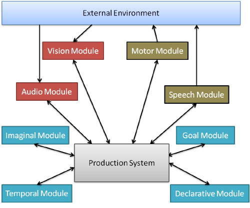

# Learning to use Python ACT-R through developing models

For this assignment, we are going to use the <a href="https://cld5070.github.io/cmpsc497-fa23/help/Introduction_to_ACT-R/">Python ACT-R</a> Cognitive Architecture to build a cognitive model

<div align="center" style="margin-bottom: 20px;"> <br />
	Figure 1: A high-level view of ACT-R, from (Dancy et al., 2015)</div>


- Why Python ACT-R instead of the canonical (CMU) version?
	- By using Python ACT-R (instead of the [canonical LISP version](http://act-r.psy.cmu.edu/software/)) you also get to use ACT-R to create agents that is more like more designing a program. Canonical ACT-R actually now includes a way to connect to Python (and even create ACT-R agents using only Python), but this version works well enough for our purposes.

- Wow this will be like a real person?!?!
	- Hoooooolllldddd up. We're learning ACT-R and practicing using it here, but it takes time to get to the point where your developing human-like cognitive models. To get to that level, you need the architecture, but you also need methods of knowledge and action elicitation (such as interaction logs for environments and [cognitive task analyses](https://catalog.libraries.psu.edu/catalog?q=cognitive+task+analysis&utf8=%E2%9C%93)). So....eh


## Setting up your environment

Head over to <a href="https://cld5070.github.io/cmpsc497-fa23/help/installing-python-act-r/"> for instructions on correctly installing Python ACT-R</a>

## Your first Python ACT-R agent

#### Let's create our first Python ACT-R Agent

Create a new file called `pizza.py`

The first thing you'll need in this file is the important statements to use the Python ACT-R library
```python

# import python_actr module library for Python ACT-R classes
import python_actr
from python_actr.actr import *

```

Now let's create the actual agent

```python

class PizzaBuilder(ACTR):
	goal = Buffer()
	my_pizza = []

	def cook_pizza(self, pizza_ingred):
		'''
		Takes in list of "ingrediants" and outputs a "pizza"
		Inputs: pizza_ingred [list of strings]
		Output: cooked_pizza [string]
		'''
		# Whats going on here? - https://docs.python.org/3/library/stdtypes.html#str.join
		return ("_".join(pizza_ingred))

	def init():
		goal.set("build_pizza prep")

	def prep_ingredients(goal="build_pizza prep"):
		#start building our Pizza!
		goal.set("build_pizza thincrust")

	def place_crust(goal="build_pizza ?crust"):
		#Place the crust
		my_pizza.append(crust)
		goal.set("build_pizza prev:crust next:sauce")

	def place_sauce_pepperoni(goal="build_pizza prev:crust next:sauce"): #utility=0.1
		my_pizza.append("sauce")
		goal.set("build_pizza prev:sauce next:mozzarella")

	def place_sauce_bbq(goal="build_pizza prev:crust next:sauce"):
		my_pizza.append("bbq")
		goal.set("build_pizza prev:bbq next:cheddar")

	def place_mozzarella(goal="build_pizza prev:sauce next:mozzarella"):
		my_pizza.append("mozzarella")
		goal.set("build_pizza prev:mozzarella next:pepperoni")
		
	def place_pepperoni(goal="build_pizza prev:mozzarella next:?ingred"):
		# Should place pepperoni, then move on to placing onions
		my_pizza.append(ingred)
		goal.set("build_pizza prev:?ingred next:onion")

	def place_onions(goal="build_pizza prev:pepperoni next:?ingred"):
		# Should place onions then move on to cooking the pizza
		pass

	def place_cook_pizza(goal="cook_pizza"):
		my_pizza = self.cook_pizza(my_pizza)
		print("Mmmmmm my " + my_pizza + " pizza is gooooood!")
		self.stop()
```

As a first try at creating your ACT-R model, try and finish the rules there so that the agent completes the (Pepperoni Pizza)
<br />
Be sure to include the code below, so that you have an empty environment to run the agent and a log that prints out

```python
class EmptyEnvironment(python_actr.Model):
	pass

env_name = EmptyEnvironment()
agent_name = PizzaBuilder()
env_name.agent = agent_name
python_actr.log_everything(env_name)
env_name.run()
```

As you might expect, `python3 pizza.py` is how you'll run your model here

##### When you're finished, you may (should) have something similar to this in your terminal:

```
   0.000 agent.production_match_delay 0
   0.000 agent.production_threshold None
   0.000 agent.production_time 0.05
   0.000 agent.production_time_sd None
   0.000 agent.goal.chunk None
   0.000 agent.goal.chunk build_pizza prep
   0.000 agent.production prep_ingredients
   0.050 agent.production None
   0.050 agent.goal.chunk build_pizza thincrust
   0.050 agent.production place_crust
   0.100 agent.production None
   0.100 agent.goal.chunk build_pizza next:sauce prev:crust
   0.100 agent.production place_sauce_pepperoni
   0.150 agent.production None
   0.150 agent.goal.chunk build_pizza next:mozzarella prev:sauce
   0.150 agent.production place_mozzarella
   0.200 agent.production None
   0.200 agent.goal.chunk build_pizza next:pepperoni prev:mozzarella
   0.200 agent.production place_pepperoni
   0.250 agent.production None
   0.250 agent.goal.chunk build_pizza next:onion prev:pepperoni
   0.250 agent.production place_onions
   0.300 agent.production None
   0.300 agent.goal.chunk cook_pizza
   0.300 agent.production place_cook_pizza
   0.350 agent.production None
Mmmmmm my thincrust_sauce_mozzarella_pepperoni_onion pizza is gooooood!
end...

```

If you don't see this, then your agent might have gone down the "BBQ Cheddar Pizza" Path.

Re-run the model until it fires the "correct" rules.

#### Now let's make it so you **can** _make_ a BBQ cheddar pizza!
Modify your agent so that it will finish by cooking a pizza when it fires `place_sauce_pepperoni` **or** `place_sauce_bbq` (i.e., it should _cook_ a pizza every time you run it!)
- When it makes a BBQ cheddar pizza, it should place cheddar cheese and **one** (and only one) other kind of topping on the pizza before cooking. 

### Keep your work in your folder!
Make sure that your pizza.py file is in your `02-cogsys1` directory

## A Python ACT-R vacuum agent in a simple grid environment
We need to create a simple ACT-R agent that can traverse the board as needed
Let's create an agent to move around in a grid environment that uses (albeit more complex) rules in a way that is similar to the one you saw in a previous example <br />

You should see a vacuumAgent.py file in the directory that you copied from the course git (assignment) repo. If you want more practice, you can create your own `vacuumAgent.py` using the code below as well.
Note that we also import an `AgentSupport` module (`AgentSupport.py`). This file has supporting structures for the agent to use, but were put in another file so that you could focus on the rules and information processing. Don't hesitate to take a look at those files to understand how things are working, but that file should remain unchanged. **The only python file that we'll use when we test your model is your `vacuumAgent.py` file, we will get rid of any mods that you might try to make to AgentSupport.py for testing purposes**.

#### Below is a starter code for you to create a rule-based roomba-like agent with a bit of explanation

Note that this should be the same code that you see in the vacuumAgent.py file you copy from the class assignment repo
The idea is to implement the strategies reported to be used by some Roombas (broadly defined) to make your agent move around in the environment and clean dirty spots

These implementation details can be found a few places - [https://www.cnet.com/news/appliance-science-how-robotic-vacuums-navigate/](https://www.cnet.com/news/appliance-science-how-robotic-vacuums-navigate/) - seems to describe it fairly well.

```python
from AgentSupport import MotorModule, CleanSensorModule, MyCell
import AgentSupport
import python_actr
from python_actr.lib import grid
import random

class VacuumAgent(python_actr.ACTR):
	goal = python_actr.Buffer()
	body = grid.Body()
	motorInst = MotorModule()
	cleanSensor = CleanSensorModule()

	def init():
		goal.set("rsearch left 1 0 1")
		self.home = None

	#----ROOMBA----#

	def clean_cell(cleanSensor="dirty:True", utility=0.6):
		motorInst.clean()

	def forward_rsearch(goal="rsearch left ?dist ?num_turns ?curr_dist",
						motorInst="busy:False", body="ahead_cell.wall:False"):
		motorInst.go_forward()
		print(body.ahead_cell.wall)
		curr_dist = str(int(curr_dist) - 1)
		goal.set("rsearch left ?dist ?num_turns ?curr_dist")

	def left_rsearch(goal="rsearch left ?dist ?num_turns 0", motorInst="busy:False",
					utility=0.1):
		motorInst.turn_left(2)
		num_turns = str(int(num_turns) + 1)
		goal.set("rsearch left ?dist ?num_turns ?dist")


		###Other stuff!


world=grid.World(MyCell,map=AgentSupport.mymap)
agent=VacuumAgent()
agent.home=()
world.add(agent,5,5,dir=0,color="black")

python_actr.log_everything(agent, AgentSupport.my_log)
python_actr.display(world)
world.run()
```

**Note that for the rules above, you are free to modify, they are included to provide an example possibility.**

### What's going on above?

---

#### For starters we define rules within a class that represents our agent. This class must have _ACTR_ as its parent class.
For now don't worry about the code above it that inherits from other classes (e.g., the `MotorModule`) these are abstractions that allow us to interact with the architecture in a principled way. For you, just know that they are an interface that is available for some small interaction with the environment.
<br />

Also notice the `init()` function: this is how we can essentially initialize our agent w/in ACT-R. It basically operates like a constructor.

Within this function, we set our initial goal (what we initially have in short-term memory when the simulation begins) and can set the value of any _slots_, which are represented as class instance attributes.

The `goal` buffer is one of the things we will use for keeping track of our current context. It provides a representation of short-term memory. (You may recall that STM is an important component of rule-based expert systems in general...in ACT-R this idea applies as well)

```python
class VacuumAgent(python_actr.ACTR):
	goal = python_actr.Buffer()
	body = grid.Body()
	motorInst = MotorModule()
	cleanSensor = CleanSensorModule()

	def init():
		goal.set("rsearch left 1 0 1")
		self.home = None
```

#### What about rules?

Rules are built within the class as functions (or methods if you prefer...but you'll notice in the snippet below that we don't really use a `self` as we would with a normal Python class method)

The argument list for a _Rule_ (Function) provides the condition (LHS, _if_, etc.) and the body provides the action (RHS, _then_, etc.)

Within our argument list, we will generally specify the state of a buffer or module. It's not important to know much about these constructs, just that they are a way for us to encapsulate behavior and functionality in a separate entity.


```python

	def clean_cell(cleanSensor="dirty:True", motorInst="busy:False", utility=0.6):
		motorInst.clean()

	def forward_rsearch(goal="rsearch left ?dist ?num_turns ?curr_dist",
						motorInst="busy:False", body="ahead_cell.wall:False"):
		motorInst.go_forward()
		print(body.ahead_cell.wall)
		curr_dist = str(int(curr_dist) - 1)
		goal.set("rsearch left ?dist ?num_turns ?curr_dist")

	def left_rsearch(goal="rsearch left ?dist ?num_turns 0", motorInst="busy:False",
					utility=0.1):
		motorInst.turn_left(2)
		num_turns = str(int(num_turns) + 1)
		goal.set("rsearch left ?dist ?num_turns ?dist")

```


Lets look at the `forward_rsearch` function a bit closer


```python
	def forward_rsearch(goal="rsearch left ?dist ?num_turns ?curr_dist",
						motorInst="busy:False", body="ahead_cell.wall:False"):
		motorInst.go_forward()
		print(body.ahead_cell.wall)
		curr_dist = str(int(curr_dist) - 1)
		goal.set("rsearch left ?dist ?num_turns ?curr_dist")
```

For our condition, we are testing whether the buffer `goal` (again, a representation of short-term memory) has slot values of `"rsearch"` and `"left"` (these are just a way to keep track of our current _strategy_ or _goal_).

Statements such as `?dist` tell the pattern matcher that we want the production to fire if there is _some_ value in that third slot, but that we don't particularly care what it is for the purposes of matching the condition. This also creates a python variable with the same name.<br />
Notice that we also use these variables to adjust the goal state _and_ we even are able to use these variables in our action:

```python
curr_dist = str(int(curr_dist) - 1)
```
The python variable `curr_dist` in the action/RHS comes from `?curr_dist` in the condition/LHS.<br />

We also use an instantiation of the `MotorModule` (and its state) and attributes of the `body` representation to specify additional constraints for the selection of this rule by the central production system.

We even `print`ed out the value for `ahead_cell.wall` using the dot operator.

#### Note that ACT-R has other cool features/theory that we don't get into for this assignment to keep things simple for now. We will get more into aspects like declarative memory in the next assignment!
Using more aspects of ACT-R would give us access to both the symbolic (e.g., _rules_ and _facts_) and the subsymbolic (_utility_ and _activation_) memory representations. The subsymbolic systems implement forms of bayesian and reinforcement learning.

### What should be in my solution?
There are artifacts that you'll need to create along the way. I've separated them into _stages_ to make it a bit easier to judge initial ordering. I'd assume you'd want to iterate through for some of these artifacts (e.g., the design) as you continue in the process. At the end I'll want the final version of all of these artifacts :-).
I list the artifacts I expect to see at the end of this section.

**Important note** Within your rules you are limited with what built-in python functionality you are allowed to use. The simple rule would be that if you don't see me using it in the example rules you see above, then you aren't allowed to use that functionality! (This includes conditionals, loops, outside functions you write or outside any other functions not used in the above rules.)


#### Stage 1 - Finish your PizzaBuilder (and make sure that you understand it!), , Suggested target date to finish: 17-Sept
- Finish the Pizza builder model
- Create a flow-diagram of how the model moves from one rule to the next (name this `pizza_design.pdf`)

#### Stage 2 - VacuumCleaner design, Suggested target date to finish: 19-Sept
- ACT-R agent design
	- You'll need to understand what data you can _perceive_ and how you might complete _actions_ in the environment
	- You should construct a high level design (e.g., similar to the flow-chart type diagram you made for your pizza builder)

#### Stage 3 - Get the model completed!
Well now it's time to pull everything together and see what you come up with!
- Use your initial designs to guide your code. Pay attention to the code provided for clues on how to make things work.
	- In addition to asking me, don't forget to check the [Python ACT-R website](../help/Introduction_to_ACT-R) to gain a deeper understanding of how it works!

- Your task is to get your vacuum to accomplish a Swirl Pattern to try and clean the room, and to trace the wall if it encounters a wall while completing the swirl pattern.
	- If you have the time and are looking for an extra challenge, you can see if you can get your vacuum cleaner to implement the Full implementation of the Roomba alg (implementing straight random strategies mentioned in the linked article)


### Deliverables (what do you need to do to get a good grade)
There are several parts to this assignment:
1. The code
	- Submit all the model code you create for this assignment. Comment the code where it makes sense
		- The only code that you are _required_ to submit is your model code, which should in `vacuumAgent.py` and `pizza.py`
	- I expect a `README_models.md` (markdown) file that gives the detail of your code (how to use it, issues, etc.)
2. The pizza builder design doc
    - Include the `pizza_design.pdf` in your repo directory


## Grading
This assignment has some fairly straightforward grading (some partial credit is implicit)
We can think about this assignment as being out of **10** points
- **3 points**: Have your agent do a swirl pattern strategy (like the Roomba alg we're trying to mimic)
- **1 point**: Have your agent do wall tracing when it encounters a wall during the swirl pattern
- **1 point**: Adequate documentation (including a minimal README)
- **3 points**:
	- Code only uses rules to accomplish actions and does not use any (python) functionality not previously OKed by Professor Dancy.
		- (No If/Else Statements, outside functions, etc unless I've said it's ok!)
- **2 points**
	- Pizza model is complete

## Document your code
### Document your code
#### Document your code
##### Document your code

## References
<div>

Dancy, C. L., Ritter, F. E., Berry, K. A., & Klein, L. C. (2015). Using a cognitive architecture with a physiological substrate to represent effects of a psychological stressor on cognition. _Computational and Mathematical Organization Theory_, 21(1), 90-114.
</div>
